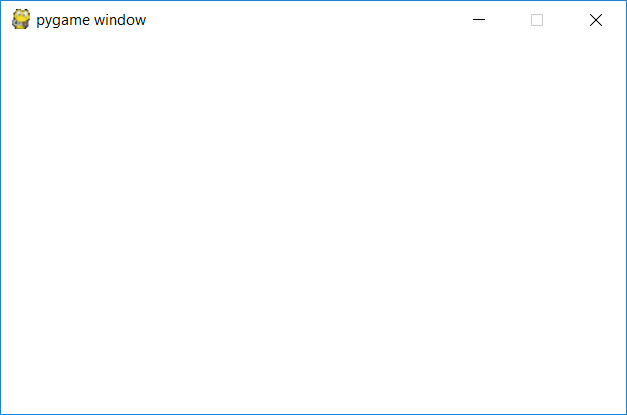
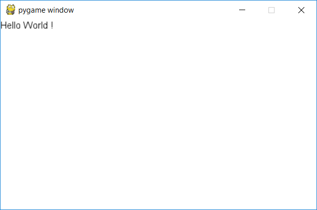

Hello World
===========

Dans ce tutoriel, nous allons créer un programme très connu : le fameux Hello World.

Grâce à ce tutoriel, vous saurez créer une fenêtre graphique 
avec un état de jeu. De plus, vous saurez utiliser le widget Label 
venant du système d'UI.

Création de la fenêtre
----------------------

La première étape est de créer la fenêtre graphique. Ici on va créer une fenêtre de 500 par 300 pixels avec un fond blanc.

Tout d'abord, il faut importer la classe de la fenêtre ainsi que de quoi utiliser les couleurs via :

.. code-block:: python

    from pyengine import Window # Window étant la classe de notre fenêtre.
    from pyengine.utils import Colors

Ensuite, il faut l'initialiser :

.. code-block:: python

    fenetre = Window(500, 300, Colors.WHITE.value)
    # 500 : Largeur
    # 300 : Longueur
    # Colors.WHITE.value : Couleur blanche

Si vous lancez ce code, vous verrez la fenêtre se lancer puis se fermer directement.

Pour régler ce problème, il faut lancer la boucle de la fenêtre. Pour cela, il suffit de faire :

.. code-block:: python

    fenetre.run()

Mais ici, vous avez une erreur. Plus précisément, une NoObjectError. 
Ceci s'explique par le fait que vous essayez de lancer la
boucle d'une fenêtre qui n'a pas de GameState.

.. note:: Une GameState est un état de votre jeu/programme. Par exemple, dans un flappy bird, il y a plusieurs états : le moment
    où il y a le menu, le moment où on joue, le moment de fin de jeu...

Création de la GameState
------------------------

Actuellement vous avez ceci :

.. code-block:: python

    from pyengine import Window
    from pyengine.utils import Colors

    fenetre = Window(500, 300, Colors.WHITE.value)
    fenetre.run()

Pour créer votre GameState, il va falloir importer puis utiliser sa classe :

.. code-block:: python

    from pyengine import GameState

    state = GameState("HelloWorld")
    # "HelloWorld" correspond au nom de votre state.

Ensuite, il faut l'ajouter à votre fenêtre via un :

.. code-block:: python

    fenetre.add_state(state)

En organisant bien votre code, vous devriez avoir quelque chose de ce style :

.. code-block:: python

    from pyengine import Window, GameState
    from pyengine.utils import Colors

    fenetre = Window(500, 300, Colors.WHITE.value)
    state = GameState("HelloWorld")
    
    fenetre.add_state(state)
    fenetre.run()

Lancez le programme et vous devriez avoir ceci :

Création du texte
-----------------

Maintenant, nous allons afficher notre texte.

Pour cela, nous allons utiliser le monde de notre GameState afin de récupérer le système qui gère l'ui.

.. code-block:: python

    from pyengine.Systems import UISystem

    uisystem = state.get_system(UISystem)

Ensuite, nous devons créer notre widget et l'ajouter à notre système :

.. code-block:: python

    from pyengine.Widgets import Label

    hello = Label([0, 0], "Hello World !", Colors.BLACK.value)
    # [0, 0] : Position x, y
    # "Hello World !" : Texte
    # Colors.BLACK.value : Couleur noire
    uisystem.add_widget(hello)

Ce qui nous donne au final :

.. code-block:: python

    from pyengine import Window, GameState
    from pyengine.Systems import UISystem
    from pyengine.Widgets import Label
    from pyengine.utils import Colors

    fenetre = Window(500, 300, Colors.WHITE.value)
    state = GameState("HelloWorld")

    fenetre.add_state(state)

    uisystem = state.get_system(UISystem)

    hello = Label([0, 0], "Hello World !", Colors.BLACK.value)
    uisystem.add_widget(hello)

    fenetre.run()

Avec comme résultat :

