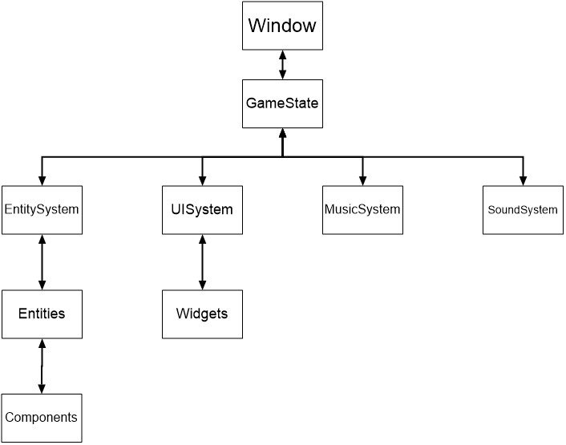
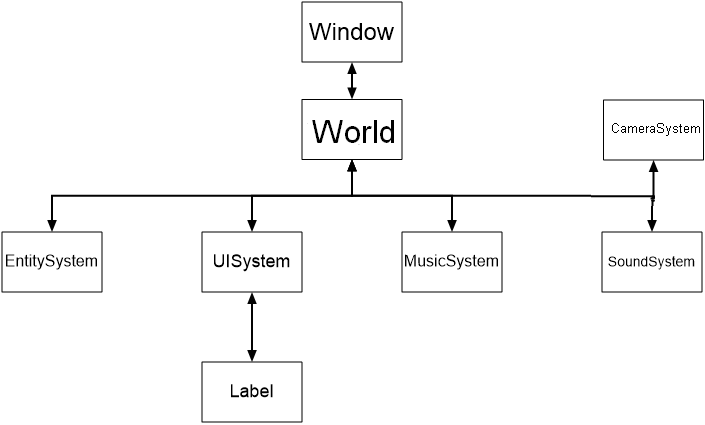
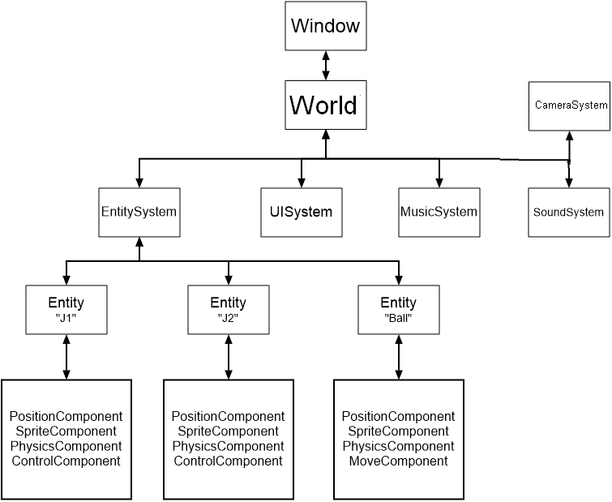

Théorie
=======

Avant de s'attaquer aux tutoriels pratiques, il est important de comprendre l'architecture général de PyEngine.

Architecture en arbre
---------------------

Il est possible de voir l'architecture de PyEngine comme un arbre.

Ceci induit plusieurs choses :

- Chaque élément peut accéder à tous les autres éléments.
- Il y a un élément initial
- Il y a des éléments transitifs
- Il y a des éléments finaux

.. note:: Accèder à n'importe quel élément à partir d'un autre est parfois caché ou idiot mais c'est toujours possible.

Window, début de Tout
---------------------

PyEngine prend comme élément initial Window.
Celui ci correspond en fait à la fenêtre qui s'ouvre quand vous le créez.

C'est à partir de lui que l'on va créer notre architecture.

Les éléments transitifs
-----------------------

Notre fenêtre a besoin de monde pour fonctionner. 
Ceux ci sont simplement les Worlds.
Ce sont eux qui vont être directement rattaché à Window et qui correspondent aux mondes que vous voyez.

Les éléments qui les suivent sont les Systems.
Actuellement PyEngine possède 5 systèmes :

- EntitySystem : Gestionnaire des entités
- UISystem : Gestionnaire des widgets
- MusicSystem : Gestionnaire de la musique de fond
- SoundSystem : Gestionnaire des sons et bruitages
- CameraSystem : Gestionnaire de la caméra

MusicSystem, CameraSystem et SoundSystem n'ont pas d'enfant et font donc aussi office d'éléments finaux.

Mais EntitySystem peut avoir comme enfant des entités et UISystem peut avoir des widgets.

Les éléments finaux
-------------------

Les entités ne sont pas forcément des éléments finaux. 
Elles ont dans la plupart des cas des composants les définissant.
Ce sont ces composants qui font office d'éléments finaux.

Du coup des widgets, ce sont bien les éléments finaux.

Représentation de l'architecture
--------------------------------

Architecture général :

Architecture du tutoriel HelloWorld :

Architecture de l'exemple Pong :

